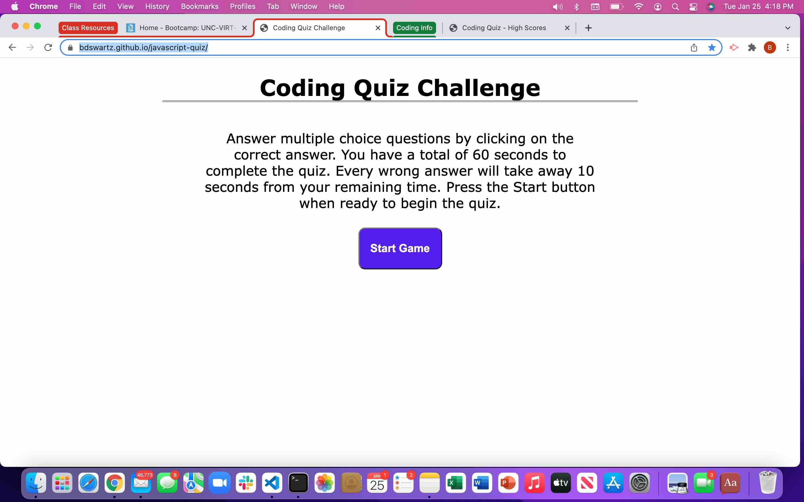
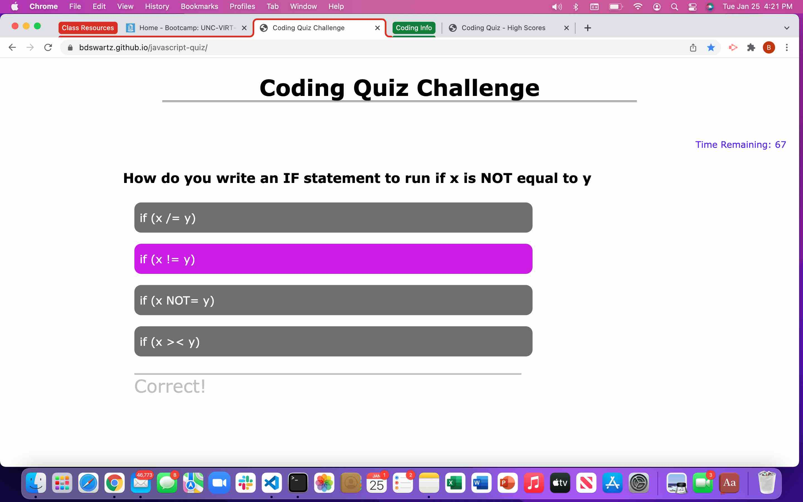
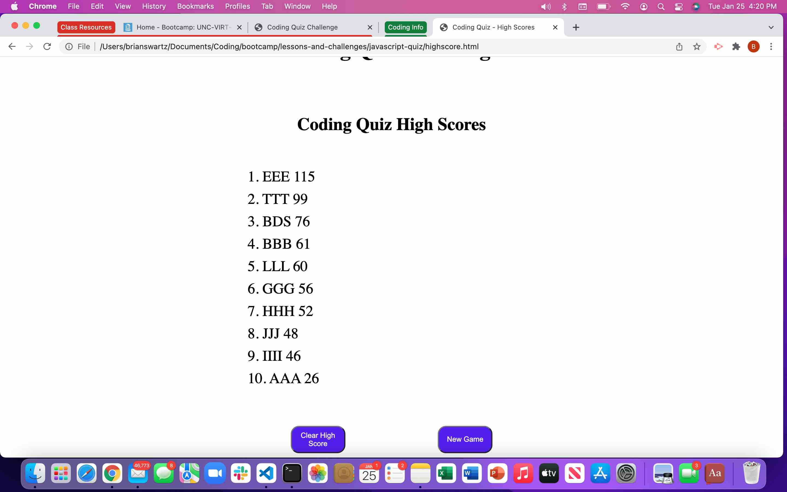

# javascript-quiz

## Purpose
A website where the user can take a timed, interactive, JavaScript test.  The user receives extra time/points for answering the questions quickly and correctly.  Once the user has completed the test (or run out of time), there is an option to add the user's score and initials to the leader board.

## Built With
* JavaScript
* CSS
* HTML

## Website
https://bdswartz.github.io/javascript-quiz/

## Contribution

## Screen Shots

The following screen shot is of the landing screen, where the instructions for game play are given and the user is allowed to start the quiz when ready.

The following screen shot is of the question and answer after the user has answered and received feedback on whether the answer is correct or not.

The following is a screen shot of the leader board, which is stored in browser storage for subsequent game play.

